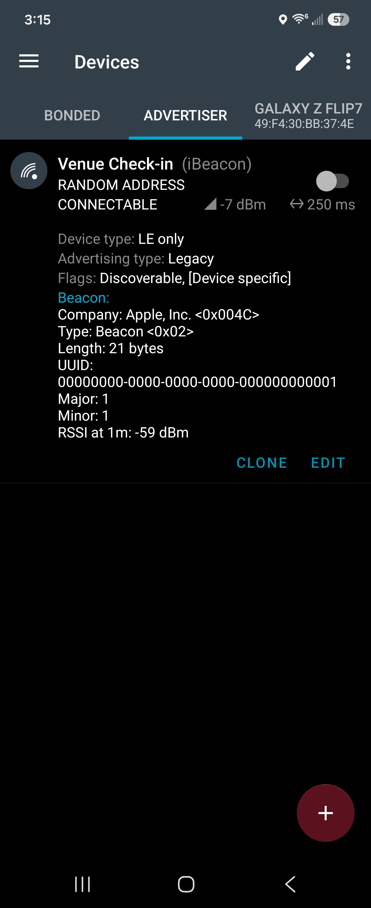

# VenueCheckIn

Detects when the user enters/exits a hardcoded venue geofence and, while inside one, scans for that venue's BLE beacon to report proximity. One Compose screen, Kotlin, Hilt, coroutines/Flow. Full design rationale and decision history are in [`planning.md`](planning.md) and [`DECISIONS.md`](DECISIONS.md) — this file covers building, running, and reproducing each transition; those two cover *why* things are built the way they are.

## Build and run

- Android Studio (current stable) or the command line with JDK 17+.
- `minSdk` 28, `compileSdk`/`targetSdk` 36/37.
- **Two physical Android devices are required to exercise the full flow** — the emulator can do Play Services geofencing but has no BLE radio at all, so the BLE half can only be tested on hardware. See "Simulating a beacon" below.

```
.\gradlew.bat :app:assembleDebug     # build
.\gradlew.bat :app:testDebugUnitTest  # run the unit test suite
```

Install the debug APK on the device you'll use as the check-in phone; install a BLE advertiser app (below) on the second device.

## Permissions

Requested together on first launch (`VenueScreen`'s `LaunchedEffect`):
- `ACCESS_FINE_LOCATION` — required for geofencing and for the app's own containment checks.
- `BLUETOOTH_SCAN` (API 31+) — required for BLE scanning. On API < 31, `ACCESS_FINE_LOCATION` alone covers BLE scanning too.

**Not yet requested: `ACCESS_BACKGROUND_LOCATION`.** It's declared in the manifest but there's no staged runtime request for it yet (Android requires it be requested separately from foreground location, not bundled). Without it, geofence transitions are only reliable while the app has been recently used in the foreground — this is a known, documented gap, not an oversight (see `planning.md` §11 / `DECISIONS.md`).

If either permission is denied, the app degrades rather than crashing: geofence state still updates, but BLE scanning simply never starts until `BLUETOOTH_SCAN`/`ACCESS_FINE_LOCATION` is granted.

## Simulating a beacon

Advertiser app: **[nRF Connect for Mobile](https://play.google.com/store/apps/details?id=no.nordicsemi.android.mcp)** (Nordic Semiconductor), using its **Advertiser** tab, on a second Android device.

Beacon identity format: **iBeacon** (UUID + major + minor) — see `DECISIONS.md` "Beacon format: iBeacon" for why this was picked over Eddystone. In nRF Connect's Advertiser tab, add a new advertising packet, set it to **iBeacon** (or build it manually as Manufacturer Specific Data, Apple company ID `0x004C`, if your version has no iBeacon template), non-connectable, and configure it per venue as below, all sharing one UUID and distinguished by major:

| Venue | UUID | Major | Minor | Suggested Tx Power |
|---|---|---|---|---|
| Lot 25 | `00000000-0000-0000-0000-000000000001` | `2` | `1` | `-59` dBm |
| House | `00000000-0000-0000-0000-000000000001` | `1` | `1` | `-59` dBm |

Use a short advertising interval (~100ms) and start advertising. Exact settings used for this project, screenshotted from nRF Connect's Advertiser tab:



See the conversation history / `DECISIONS.md` for exact byte-level payload details if you need to sanity-check the raw advertisement.

## Venue coordinates

Hardcoded in `VenueRepository.kt` (`app/src/main/java/.../data/venue/VenueRepository.kt`):

| Venue | Latitude | Longitude | Radius |
|---|---|---|---|
| Lot 25 | `30.175302` | `-97.272680` | `50m` |
| House | `30.175328` | `-97.272628` | `50m` |

Radii are 50m — below Google's own recommended 100–150m minimum for reliable geofence accuracy (see `DECISIONS.md`). Real-world accuracy near the boundary can vary by tens of meters; this is an inherent characteristic of small-radius geofences, not a bug.

To test without physically visiting these coordinates: on a real device, install a mock-location app and select it under Developer Options → "Select mock location app," then set it to one of the coordinates above (nudge slightly, e.g. add `0.0003`° to lat/lon, to test "just outside the radius" vs. dead-center).

## Reproducing each transition

The UI shows two separate logs: **Geofence Log** (venue ENTER/EXIT) and **Beacon Log** (proximity readings), plus a current-state line and a "● Scanning / ○ Not scanning" indicator at the top.

**Already inside (requirement 2).** Mock/walk your location to inside a venue's radius *before* opening the app (or before granting permission). On launch, once `ACCESS_FINE_LOCATION` is granted, the app should log "Entered <venue>" within a second or two — this goes through a local containment check (`ContainmentChecker` + a fresh location fix), not through Play Services' own detection, specifically because that path is slow (see below). `isScanning` should flip on shortly after, targeting that venue's beacon.

**Enter (real OS-detected crossing).** Start outside every venue with the app already running and permission granted, then mock/walk into a venue's radius. Play Services' own `INITIAL_TRIGGER_ENTER`/crossing detection is opportunistic — **budget up to several minutes** for "Entered <venue>" to appear in the Geofence Log. This is real Play Services latency, not an app bug.

**Exit.** While Inside a venue with scanning active, mock/walk outside its radius. Two independent paths can produce the "Exited <venue>" log entry and stop scanning:
1. Play Services' real geofence EXIT broadcast — also opportunistic, budget several minutes.
2. If the beacon signal is lost first (see below) and stays lost for `DEFAULT_GEOFENCE_EXIT_POLL_INTERVAL` (30s, configurable), the app re-checks your actual location directly and forces the same exit path if you're confirmed outside the radius — usually faster than waiting on Play Services alone. See `GeofenceExitPoller` / `DECISIONS.md`.

Either path produces the same "Exited <venue>" log entry and the same `isScanning → false` transition — there's no way to tell which one fired from the UI alone (check logcat, tag `VenueMonitor`, if you need to distinguish them).

**Beacon found.** Once Inside a venue with the advertiser broadcasting nearby, the Beacon Log should start appending entries within a few advertisement intervals (usually well under a second), each showing a `Proximity` bucket (Immediate/Near/Far) and an estimated distance. The current-state line updates to `Inside <venue> - <bucket>`.

**Beacon lost.** With the advertiser running, stop advertising (or move it out of range). After `DEFAULT_BEACON_LOST_TIMEOUT` (5s, configurable, see `BeaconLostTimer`) with no new advertisement, a `Proximity.UNKNOWN` entry appears in the Beacon Log and the current-state line falls back to `Inside <venue> - waiting for beacon...`. If the advertiser resumes before the timeout, no lost entry appears — smoothing/timing just continues.

## Architecture

See `CLAUDE.md` for the package layout and the key design decisions (in particular, why `VenueMonitor` — not the ViewModel, not the foreground service — owns the actual monitoring logic). `planning.md` has the full requirement-by-requirement design exploration; `DECISIONS.md` is the decision log, including several findings from testing on real hardware that are worth reading before assuming something is broken (geofence transition latency, the 50m-radius accuracy tradeoff, and others).

## Tests

`app/src/test/` — plain JUnit + `kotlinx-coroutines-test`, no Robolectric needed. Covers containment/"already inside" logic, RSSI smoothing, the beacon-lost and geofence-exit-poll timeouts (via coroutine virtual time), and the state machine including that EXIT actually stops scanning. Run via `.\gradlew.bat :app:testDebugUnitTest`.
